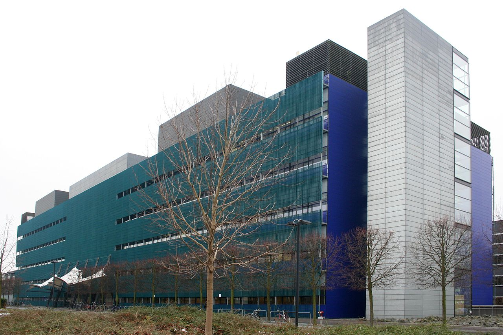

# 

## MPI CBG

[columns,class="row vertical-align"]

[column,class="col-xs-6"]

* 500 staff
* 50 % non-german
* founded 2001

[/column]

[column,class="col-xs-6"]

* cell biology
* genomics
* systems biology

[/column]

[/columns]

## microscopes

[columns,class="row vertical-align"]

[column,class="col-xs-6"]

 (no license)](img/LZ1_-_Zeiss_Lightsheet_Z.1_600p.jpg)

[/column]

[column,class="col-xs-6"]

 (no license)](img/2I_1D_OpenSPIM_farm_02_600p.jpg)

[/column]

[/columns]

[columns,class="row vertical-align"]

[column,class="col-xs-6"]

* Commercial system (2 inhouse)
* 120 MB/s imaging data
* at best run 24/7

[/column]

[column,class="col-xs-6"]

* custom systems (>6 inhouse) 
* > 850 MB/s imaging data
* at best run 24/7

[/column]

[/columns]

## Parallel Processing Essential 

Picture of screaming student!

# On the Road to Cluster Computing

## Sqeazy

* project with Myers Lab since fall 2014 (20 k€ of hours)
* hosted on bitbucket (private until publication)
* do not reinvent the wheel (sqeazy = pipeline of know algorithms/compressors)
* offer lossless and lossy compression
* Java interface on top of fast C++ implementation
* be corss platform (win, Linxu, OSX)
* ...

## Goal

<object type="image/svg+xml" data="img/codec_overview_corpus_original_st.svg"
width="1200" border="0" style="background-color: #FFFFFF;">
</object>

**fast and high compression rate is hard**

#

## Lossless pipelines

Problem: Data is quite noisy for common compressors (LZ4, ZIP, LZO, ...)

[columns,class="row vertical-align"]

[column,class="col-xs-6"]

<object type="image/svg+xml" data="img/LZ4_corpus_no_legend_original_st.svg"
width="700" border="0" style="background-color: #FFFFFF;">
</object>

**Original**

[/column]

[column,class="col-xs-6"]

<object type="image/svg+xml" data="img/LZ4_corpus_no_legend_denoised_st.svg"
width="700" border="0" style="background-color: #FFFFFF;">
</object>

**Denoised**

[/column]

[/columns]

## Trick: Bitplane reordering

We know that most randomness/noise is contained in low values of intensity!

+--------+---------+--------+--------+--------+--------+---------+--------+--------+
|original| 0       |1       |0       |1       |5       |0        |1       |1       |
+--------+---------+--------+--------+--------+--------+---------+--------+--------+
|as bits | 00000000|00000001|00000000|00000000|00000101|00000000 |00000001|00000001|
|        |         |        |        |        |        |         |        |        |
+--------+---------+--------+--------+--------+--------+---------+--------+--------+
|bit     | 00000000|00000000|00000000|00000000|00000000| 00001000|00000000|01001011|
|swapped |         |        |        |        |        |         |        |        |
+--------+---------+--------+--------+--------+--------+---------+--------+--------+

## sub-summary

* achieved 20 MB/s on single core
* compression ration of at least 2 with lossless pipeline
* bitplane reordering implemented with SSE based SIMD (AVX2 would be a lot faster)

#

## Lossy pipelines

* Try to estimate noise and remove it (heuristic):

1. scan first and last, top and bottom plane
2. compute mad + deviation around mad of intensity in each
3. threshold stack (cut off noise) per pixel
4. perform neighborhood majority vote for high intesity pixels in background environment

## sub-summary

* achieved 20 MB/s on single core
* compression ration of at least 5 
* would be nice to automate background/signal destinction

# Summary

* fun project
* 100 % test-driven (on C++ and java side)
* performance is demanding and yet not final
* next steps:
    - consolidate java interface
    - consolidate hdf5
    - h.264/h.265
	- multi-core
	- documentation/publication
	- ...
