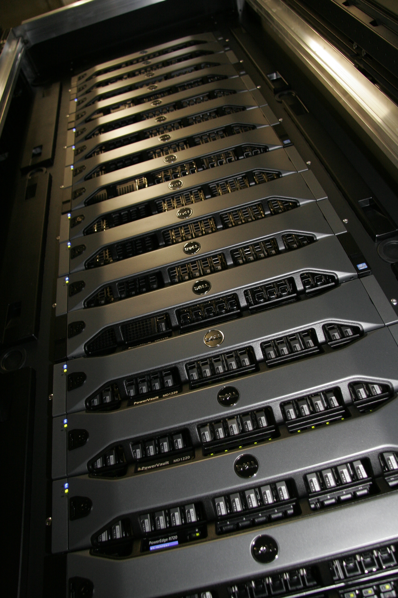
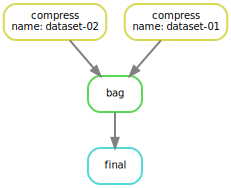

# Outline

## 

<div style="font-size: 2.5em;text-align: center;">
1. Background

2. [Bazaar](https://en.wikipedia.org/wiki/The_Cathedral_and_the_Bazaar)

3. [Cathedral](https://en.wikipedia.org/wiki/The_Cathedral_and_the_Bazaar)
</div>

# 

## Max Planck Institute of Molecular Cell Biology and Genetics

[columns,class="row vertical-align"]

[column,class="col-xs-8"]


[/column]

[column,class="col-xs-4"]

* 500 staff
* founded 2001
* cell biology
* genomics
* systems biology

[/column]

[/columns]

## Standard Biological Instruments

[columns,class="row vertical-align"]

[column,class="col-xs-6"]

**Genome Sequencer**

](img/HiSeq_2000_800x.jpg)

[/column]

[column,class="col-xs-6"]

**Standard Microscopes**

](img/MPI-SD3_x521.jpg)

[/column]

[/columns]

[columns,class="row vertical-align"]

[column,class="col-xs-6"]

* commercial system 
* 25 Mbp/s
* a lot of secondary large data

[/column]

[column,class="col-xs-6"]

* commercial systems 
* 100 MB/s data production
* operated in bursts

[/column]

[/columns]

## microscopes

[columns,class="row vertical-align"]

[column,class="col-xs-6"]

**Zeiss Lightsheet Z.1**

](img/LZ1_-_Zeiss_Lightsheet_Z.1_600p.jpg)

[/column]

[column,class="col-xs-6"]

**T-SPIM Farm**

](img/2I_1D_OpenSPIM_farm_02_x450_cropped.jpg)

[/column]

[/columns]

[columns,class="row vertical-align"]

[column,class="col-xs-6"]

* commercial system (2 inhouse)
* 120 MB/s data production
* at best: operated 24/7

[/column]

[column,class="col-xs-6"]

* custom systems (>6 inhouse) 
* 850 MB/s data production
* at best: operated 24/7

[/column]

[/columns]


## Parallel Processing Essential!

<div style="text-align: center;">
 (CC BY-SA 2.0)](img/college_student_computer.jpg) 
</div>

# {.section data-background="img/On_the_road_cc_sa_2d0.jpg"}

## On the Road to Cluster Computing {.h2 style="font-size: 2em;"} 

## Who has ever worked on HPC cluster? {.h2 style="font-size: 2em;"}


#

## Madmax

[columns,class="row vertical-align"]

[column,class="col-xs-4"]



[/column]

[column,class="col-xs-8"]

* 44 nodes

	* 2x6 cores (Sandy Bridge)
	
	* 128 GB RAM
	
	* 1 TB local drive


* 200 TB Lustre parallel file system (400 MB/s to each node)

* jobs are manually defined by batch system (LSF)

```
$ bsub -o hw.log -q short -n 1 echo "Hello World!"
```

[/column]

[/columns]


## The Daily Torture

[columns,class="row vertical-align"]

[column,class="col-xs-6"]

 (public domain)](img/600px-Punishment_sisyph.jpg)

[/column]

[column,class="col-xs-6"]

* bsub made for large (MPI driven) applications

* data-driven workflows "hard(er)" to implement

	* soon: bsub wrapped by bash scripts

	    - eventually: bsub scripts wrapped by other scripts

		- or: bash scripts generating bash scripts


### Warning: error prone, not fun, not productive! 

[/column]

[/columns]


## Where many HPC users come from

<div style="font-size: 1.2em">
```
1. bsub <opts> /path/to/app-A in.ext1 out.ext2

2. bsub <opts> /path/to/app-B *.ext2 summary.ext3

3. bsub <opts> /path/to/app-C *.ext3 results.final
```
</div>


* **pipelines are everywhere!** (data sciences)

* most of the above with high influx of *.ext1 files

* more complex configurations on top (domain parameters, number of threads, gpus)

## It would be nice to have

* lightweight

* rule based <br> (most pipelines consist of fixed steps, input/parameters is what changes)

* text based (for [version control](git-scm.org))

* easy to extend and flexible

<div style="font-size:2em;text-align: center;" class="fragment">
**[Snakemake](https://bitbucket.org/johanneskoester/snakemake/wiki/Home)**
</div>

#

## Snakemake


[columns,class="row vertical-align"]

[column,class="col-xs-6"]

* free and open-source
* written in python3
* motivated by GNU make

[/column]

[column,class="col-xs-6"]

* write <em>Snakefile</em> in Domain Specific Language
* Snakefile contains rules to evaluate

[/column]

[/columns]

## Domain Specific Language?


```
rule targets:
    input:
        'plots/dataset1.pdf', 
        'plots/dataset2.pdf'

rule plot:
    input:
        'raw/{dataset}.csv'
    output:
        'plots/{dataset}.pdf'
    shell:
        'somecommand {input} {output}'
```


* logic based on input/output files (here through pseudo-rule "targets")

* directed acyclic graph build up

* graph can be decomposed (independent/dependent tasks)

## A simple example

<center>
 <object type="image/svg+xml" data="img/simple.svg" width="1000" border="0" style="background-color: #FFFFFF;"> 
 </object>
</center>
<!-- ## A simple example -->

<!-- <object type="image/svg+xml" data="img/simple.svg" -->
<!-- width="1000" border="0" style="background-color: #FFFFFF;"> -->
<!-- </object> -->
<!--  -->

## A simple Snakemake file

<div style="max-height: 100%;">
```python
$ cat Snakefile
DATAFILES = ['dataset-01.dat','dataset-02.dat']
OUTPUT = [ item.replace(".dat",".zip") for item in DATAFILES ]

rule final:
    input: 'bag.tar'

rule compress:
    input:  '{name}.dat'
    output: '{name}.zip'
    shell:  'zip {output} {input}'

rule bag:
    input:  OUTPUT
    output: 'bag.tar'
    shell:  'tar cf {output} {input}'
```
</div>

## Running the Snakefile

```
$ snakemake -n -r #let's see what's going on
$ snakemake #run it
$ snakemake --dag | dot -Tpdf > dag.pdf #produce graph
```

See [Snakefile](https://idisk.mpi-cbg.de/~steinbac/resources/20150430/examples/Snakefile) in [examples](https://idisk.mpi-cbg.de/~steinbac/resources/20150430/examples) to this presentation!

## Features

* custom command line args can be handed over to 
```
$ snakemake -s cli_args.snake --config inputfiles="*dat"
```

* snakemake is cluster aware
```
$ snakemake --cluster "bsub -n 32"
```

* snakemake <em>params</em> to decorate rules for cluster execution
```
rule:
    input:  ...
    output: ...
    params: runtime="04:00"
    shell: ...
```

```
$ snakemake --cluster "bsub -W {params.runtime}"
```

## Advanced Features

* benchmarking

```
rule benchmark_command:
    input:
        "path/to/input.{sample}.txt"
    output:
        "path/to/output.{sample}.txt"
    benchmark:
        "benchmarks/somecommand/{sample}.json"
    shell:
        "somecommand {input} {output}"
```


```
$ snakemake --benchmark-repeats <number>
```

##

* Embedded Python

```
rule compose_merge:
    input:
        expand('assembly/{sample}/transcripts.gtf', sample=SAMPLES)
    output:
        txt='assembly/assemblies.txt'
    run:
        with open(output.txt, 'w') as out:
            print(*input, sep="\n", file=out)
```

##

* Embedded R

```
from snakemake.utils import R

SOMECONSTANT = 42

rule:
    input:  ...
    output: ...
    run:
        R("""
        # Access any global/local variables with the braces notation
        sqrt({SOMECONSTANT});
        # be sure to mask braces used in R control flow by doubling them:
        if(TRUE) {{
            # do something
        }}
        """)

```

## Resources

* [good documentation](https://bitbucket.org/johanneskoester/snakemake/wiki/Documentation)

* [basic examples](https://bitbucket.org/johanneskoester/snakemake/wiki/Examples) (Cufflinks, Building a C Program, miRNA Analysis Pipeline, ...)

* [alive google groups forum](https://groups.google.com/forum/#!forum/snakemake)

* [repo with ready made snakefiles](https://bitbucket.org/johanneskoester/snakemake-workflows) (mostly bioinformatics workflows, open for contributions)

* quite some talks, papers ...

## Snakemake Summary

[columns,class="row vertical-align"]

[column,class="col-xs-6"]

* great tool (also for programming beginners)

* free and open-source

* great community

* great documentation

[/column]

[column,class="col-xs-6"]

, CC BY-SA-3.0)](img/Bd_bazaar.jpg)

[/column]

[/columns]


**But sometimes ... you need a cathedral!** 


#

## 

* distributed computing framework

* requires a cluster manager (native, Yarn, Mesos) 

* requires a distributed storage system (native, HDFS, Cassandra, Amazon S3)

<div style="text-align: center;">
 Software Stack](img/spark-stack.png)
</div>

## Spark Core = Resilient Distributed Datasets

[columns,class="row vertical-align"]

[column,class="col-xs-6"]

*Architectural Motivation*

(nothing-shared cluster)

, figure 5)](img/spark_rdd_fig2_larger.png)


[/column]

[column,class="col-xs-6"]

*Operation Lineage*

(deferred dispatch, fault taulerance)

, figure 5)](img/spark_rdd_fig5_larger.png)

[/column]

[/columns]

## Spark Code

* spark written in Scala (JVM based multi-paradigm language)

* supports python, R and Java

* code very simple, provides primitives for most (all) data-parallel tasks

* example:

<center>
```
from pyspark import SparkContext

sc = SparkContext(appName="PythonExample")

colorlist = sc.parallelize(my_filelist).map(my_color_image).reduce(add)

sc.stop()
```
map-reduce with user-defined map function <em>my_color_image</em> and reducer <em>add</em>
</center>

## Spark Scalability

[columns,class="row vertical-align"]

[column,class="col-xs-8"]

<center>

</center>

[/column]

[column,class="col-xs-4"]

* pi estimation example from distribution

[/column]

[/columns]


## Still some work to do!

[columns,class="row vertical-align"]

[column,class="col-xs-8"]

<center>

</center>

[/column]

[column,class="col-xs-4"]

* using custom python modules tricky

* timings make NO sense (py4j overhead?)

[/column]

[/columns]


## Spark Summary

* clearly Spark is subject to hype right now

* integration with classical HPC systems doable, but cumbersome

* syntax is clean and easy to adapt (complexity hidden)

* no advertisement for spark here, but placeholder for good library/framework that leverages performance and developer fun

# Summary

* 

## Thank you ...

for your attention!
